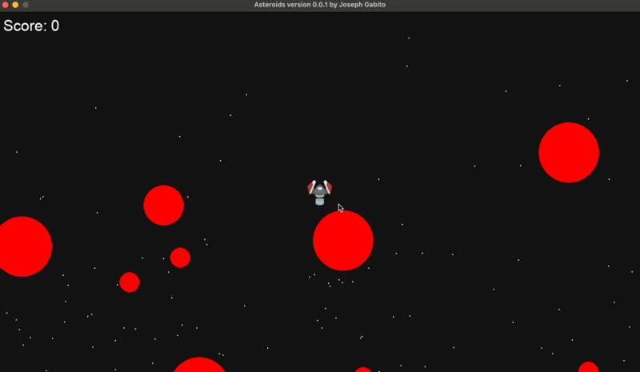

# 🚀 pyasteroid

A modern, Python-powered take on the classic arcade game **Asteroids** — built with `pygame` as part of my journey through [Boot.dev](https://boot.dev). Smooth movement, shooting, splitting asteroids, score tracking, sound effects, and a clean retro vibe.

https://share.cleanshot.com/1qqRfsJ7



---

## 🎮 Features

- 🌀 Full 360° ship movement and rotation
- 🔫 Shooting mechanics with bullet tracking
- 💥 Asteroids that split into smaller pieces
- 🧠 Collision detection using hitboxes
- 🔊 Sound effects (explosions, etc.)
- 🌌 Procedural starfield background with layered parallax
- 🔢 Scoring system based on asteroid size
- 📦 Clean object-oriented Python structure

---

## 🛠 Built With

- [Python](https://www.python.org/)
- [Pygame](https://www.pygame.org/)

---

## 📦 Installation

1. Clone this repo:
   ```bash
   git clone https://github.com/JosephGabito/pyasteroid.git
   cd pyasteroid

2. Install dependencies
    ```bash
    pip install pygame

3. Run the game:
    ```
    python main.py

